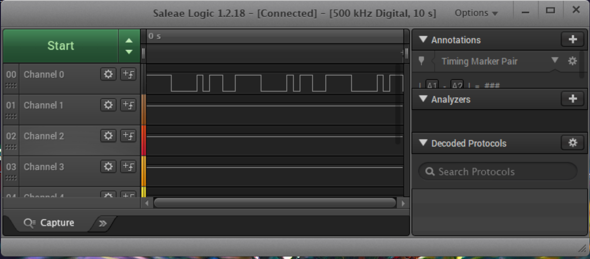
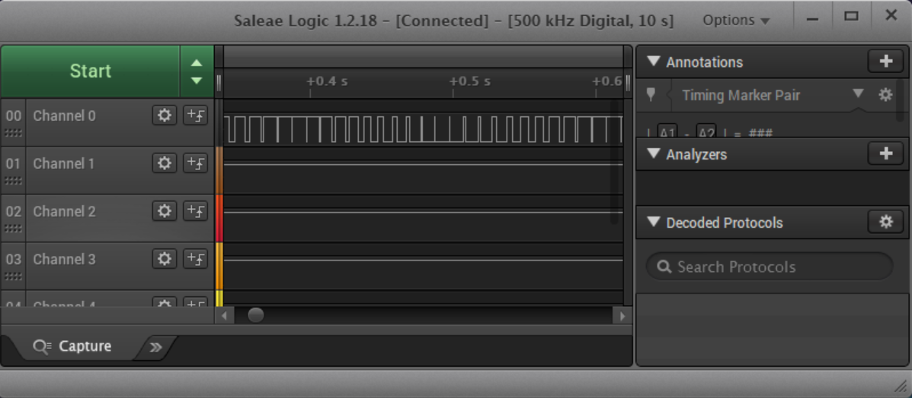
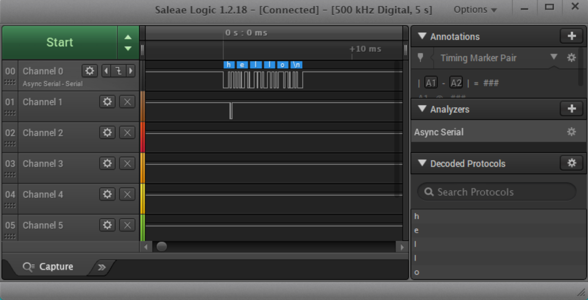
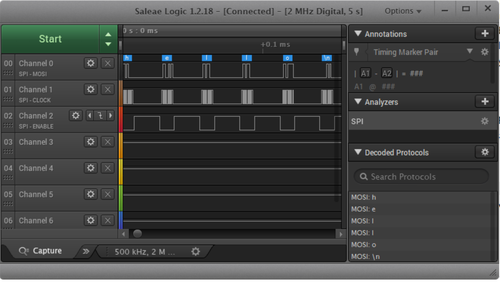

Name: Ethan Hardy

EID: emh3563

Team Number: F7

## Questions

1. Why does your program need a setup and a loop?

    The set up is needed to initialize pins as outputs or inputs. The loop is needed to run processes that need to be repeated over and over again.

2. What is the downside to putting all your code in a loop?

    It would be less efficient because parts of the code involved in the setup that only need to be called once would be called every single time the loop is run.

3. Why does your code need to be compiled?

    The computer can only read machine code, so the arduino code needs to be changed into machine code.

4. When lowering the frequency in procedure A, step 4, what is going wrong? Brainstorm some solutions. Dimmers exist in the real world. What is their solution?

    The frequency is too small, so the on time of the led is too short and the off time is too large. The solution would be to increase the frequency so that the led is on for longer amounts of time.

5. Why do you need to connect the logic analyzer ground to the ESP32 ground?

    The ground needs to be consistent for the circuit to work and to get an accurate reading on the logic analyzer.

6. What is the difference between synchronous and asynchronous communication?

    Synchronous communication is done on constant time intervals and there is no gap between data. Asynchronous communication is done on random time intervals and there are gaps between information.

7. Profile of UART: Sent X bytes in Y time 

    Sent 6 bytes in 6.267 milliseconds

8. Profile of SPI: Sent X bytes in Y time

    Sent 7 bytes in 0.181 milliseconds.

9. Why is SPI so much faster than UART?

    UART requires more work to decode which limits the maximum data rate. Also UART is asynchronous communication while SPI is synchronous communication.

10. list one pro and one con of UART

    Pro: The hardware complexity is low.
    Con: Uart is only suitable for communication between two devices.

11. list one pro and one con of SPI

    Pro: SPI is faster than I2C and UART.
    Con: SPI requires pins for each device that wants to be connected.

12. list one pro and one con of I2C

    Pro: Only needs two lines for multiple devices because each device has its own software address.
    Con: It requres pull-up resistors which increases power dissipation, consumes PCB real estate, and limit clock speed.

13. Why does I2C need external resistors to work?

    Devices using I2C can only pull the signal line low, so that one device isn't pulling it high while another is pulling it low. The pull-up resistors are then used to restore the signal to high when no device is asserting it low.

## Screenshots

Procedure A, step 1:

Procedure A, step 4:

Procedure B, UART:

Procedure B, SPI:

